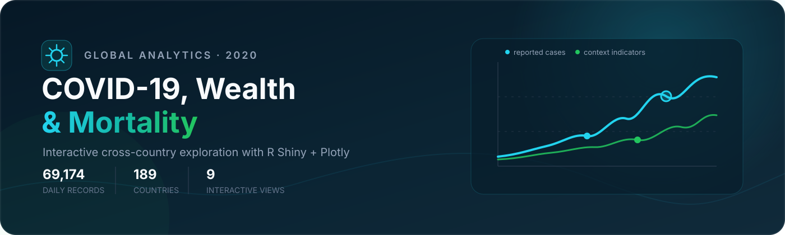

<div align="center">



# COVID-19, Wealth & Mortality

<p>An interactive R Shiny dashboard for exploring the first pandemic year</p>

[](https://www.r-project.org/)
[](https://plotly.com/r/)
[](#dataset-at-a-glance)
[](#dataset-at-a-glance)

<strong>69,174 daily country records · 189 countries · 9 interactive analytical views</strong>

</div>

> **20-second overview.** This project examines how reported COVID-19 cases and deaths evolved across 189 countries during 2020 and places those outcomes alongside population, GDP per capita, and health-expenditure indicators. The application offers a global comparison workspace and a country-level drill-down, implemented as a modular R Shiny app with Plotly visualizations. It is an exploratory dashboard—not a causal study, forecasting model, or source of medical guidance.

## Why this project exists

Raw pandemic counts are difficult to compare across countries because population size, reporting practices, economic conditions, and health-system context differ substantially. The dashboard brings those dimensions into one interface so that a user can:

- follow the timing and intensity of reported infection waves;
- compare cumulative incidence between countries and dates;
- inspect the relationship between health expenditure and case fatality;
- position countries in an incidence–fatality matrix; and
- move from a global overview to a focused country timeline.

The interface is written in **Spanish**. This repository documentation is in English so the technical work remains accessible to a broader audience.

## Dataset at a glance

The figures below were computed directly from the bundled processed dataset, [`data/panel_2020_paises_sin_nan_R_clean.csv`](data/panel_2020_paises_sin_nan_R_clean.csv).

| Property | Verified value |
|---|---:|
| Date coverage | 2020-01-01 to 2020-12-31 |
| Countries / ISO3 codes | 189 |
| Daily observations | 69,174 |
| Observations per country | 366 |
| Variables | 16 |
| Missing values | 0 |
| Duplicate country-date rows | 0 |
| Confirmed cases at each country's final observation | 83,488,774 |
| Deaths at each country's final observation | 1,865,446 |

The application reports the mean of the 189 country-level case-fatality ratios for its global KPI. This is an **unweighted country mean**, not the ratio obtained by dividing worldwide deaths by worldwide confirmed cases.

See the complete field-level description in [`docs/DATA_DICTIONARY.md`](docs/DATA_DICTIONARY.md).

## Analytical experience

### Global comparison

| View | Question answered | Main controls / encodings |
|---|---|---|
| Animated choropleth | Where was weekly reported incidence highest? | 53 weekly frames; incidence per 100,000; 95th-percentile color cap |
| Wave comparison | When did selected countries experience their strongest waves? | Up to 8 countries; weekly cases normalized by each country's maximum |
| Incidence dumbbell | How much did cumulative incidence change between two dates? | Up to 15 countries; configurable start and end dates |
| Health spending vs fatality | How are health expenditure and case fatality distributed together? | Population-sized bubbles; GDP per capita as color |
| Incidence–fatality matrix | Which countries fall above or below the displayed medians? | Optional country filter; median reference lines; health spending as color |

### Country drill-down

Select a country and date range to obtain:

- cumulative confirmed cases at the end of the chosen period;
- deaths, incidence per 100,000, case fatality, and health expenditure;
- a monthly cumulative-case timeline;
- a normalized radar comparison against the world mean; and
- monthly new-case and death bars with peak-month annotations.

## Methodological design

The application makes several deliberate analytical choices:

1. **Population normalization.** Incidence and mortality are expressed per 100,000 residents, allowing more meaningful cross-country comparison than raw counts alone.
2. **Daily-to-weekly aggregation.** The map aggregates daily values into 53 week-start groups to make temporal animation readable and computationally manageable.
3. **Within-country wave normalization.** Each ridgeline is divided by that country's maximum weekly count. This compares wave shape and timing, not absolute burden.
4. **Robust map scaling.** The choropleth upper bound is the 95th percentile of weekly incidence, reducing the visual dominance of extreme observations.
5. **Median-based quadrants.** The efficiency matrix uses the displayed sample medians as visual reference lines. The quadrants are descriptive and do not constitute a health-system performance score.
6. **Min–max radar scaling.** Country and world-reference metrics are mapped to `[0, 1]`; values are relative to the dataset range and should not be interpreted as quality grades.

Definitions, formulas, transformations, and interpretive cautions are documented in [`docs/METHODOLOGY.md`](docs/METHODOLOGY.md).

## Run locally

### 1. Clone the repository

```bash
git clone https://github.com/luistrge/covid19-wealth-mortality.git
cd covid19-wealth-mortality
```

### 2. Install the runtime packages

```r
install.packages(c(
  "shiny",
  "plotly",
  "dplyr",
  "tidyr",
  "lubridate",
  "readr",
  "htmltools",
  "glue",
  "rlang"
))
```

### 3. Start the dashboard

From a terminal:

```bash
Rscript -e 'shiny::runApp()'
```

Or from an R session:

```r
shiny::runApp()
```

RStudio users can open [`app.R`](app.R) and select **Run App**. The process prints a local address such as `http://127.0.0.1:xxxx`; open that address in a browser.

To run the current GitHub version without cloning it first:

```r
shiny::runGitHub("covid19-wealth-mortality", "luistrge")
```

> The repository does not currently advertise a hosted deployment. The commands above run the application locally.

## Project structure

```text
covid19-wealth-mortality/
├── app.R                         # Shiny UI, server, navigation, reactive outputs
├── R/
│   ├── utils.R                   # Data loading, formatting, weekly aggregation
│   ├── data_processing.R         # Compatibility shim; points to utils.R
│   ├── plots_global.R            # Five global Plotly views
│   └── plots_country.R           # Four country-level Plotly views
├── data/
│   └── panel_2020_paises_sin_nan_R_clean.csv
├── docs/
│   ├── DATA_DICTIONARY.md        # Schema, units, and derived fields
│   ├── METHODOLOGY.md            # Transformations, assumptions, limitations
│   └── assets/
│       └── repository-banner.svg
└── www/
    └── styles.css                # Responsive dark dashboard theme
```

The code is already separated by responsibility: [`app.R`](app.R) handles reactive application flow, [`R/utils.R`](R/utils.R) handles the processed data, and the two plotting modules contain the visualization logic.

## Data provenance and reproducibility boundary

The project attributes epidemiological fields to the [WHO COVID-19 data collection](https://data.who.int/dashboards/covid19/data) and the socioeconomic fields to World Bank indicators, including [GDP per capita](https://data.worldbank.org/indicator/NY.GDP.PCAP.CD) and [current health expenditure as a share of GDP](https://data.worldbank.org/indicator/SH.XPD.CHEX.GD.ZS).

The repository includes the **processed analytical panel**, but it does not include raw source snapshots, download dates, source indicator IDs embedded in the CSV, or the pipeline that produced that panel. Consequently:

- the dashboard is reproducible from the bundled CSV;
- the upstream data-acquisition and cleaning process is not fully reconstructable from this repository alone; and
- present-day values from the source organizations may differ because public-health series can be revised retrospectively.

This boundary is stated explicitly to distinguish a reproducible application from a fully reproducible raw-data pipeline.

## Interpretation and limitations

- Reported cases and deaths depend on national testing, definitions, reporting frequency, and retrospective corrections.
- Case-fatality ratio is based on reported confirmed cases; it is not an infection-fatality estimate.
- Cross-country scatter plots reveal association, not causation. They do not control for age structure, outbreak timing, policy, testing intensity, reporting quality, or other confounders.
- GDP per capita is explicitly labeled `2019` in the dataset. The reference year for `gasto_salud_pib` is not encoded in the processed file and should not be inferred from the interface.
- A zero-filled, complete panel is convenient for visualization but does not prove that every zero represents a confirmed absence rather than unavailable reporting upstream.
- The dashboard covers 2020 only and should be read as a historical exploratory artifact.

## Technology

| Layer | Tools |
|---|---|
| Application | R, Shiny |
| Interactive graphics | Plotly |
| Data manipulation | dplyr, tidyr, lubridate, readr |
| UI composition | htmltools, glue |
| Styling | CSS, Inter, inline SVG |

## License status

No software license is currently declared in this repository. In the absence of a license, reuse rights are not granted automatically. The bundled data may also be governed by the terms of its upstream providers. Add a license only after confirming that both the code ownership and data-distribution terms permit it.

---

<div align="center">

Built with **R Shiny**, **Plotly**, and a focus on transparent exploratory analysis.

[Source code](https://github.com/luistrge/covid19-wealth-mortality) · [Data dictionary](docs/DATA_DICTIONARY.md) · [Methodology](docs/METHODOLOGY.md)

</div>
